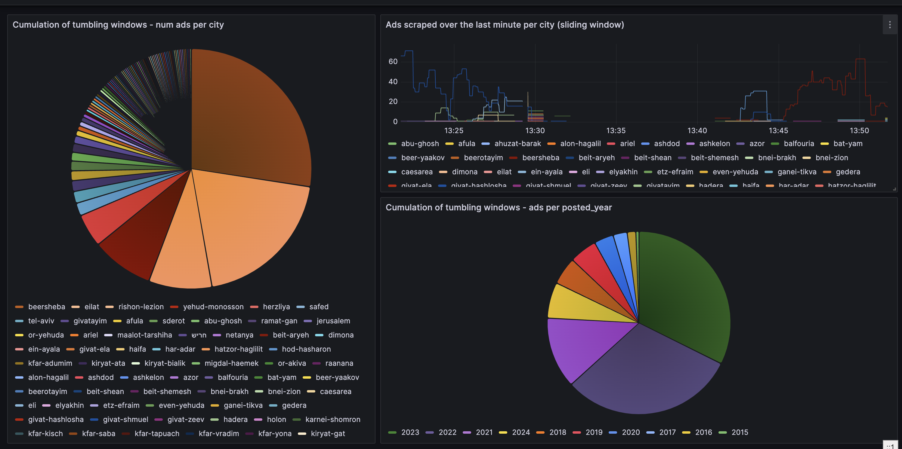
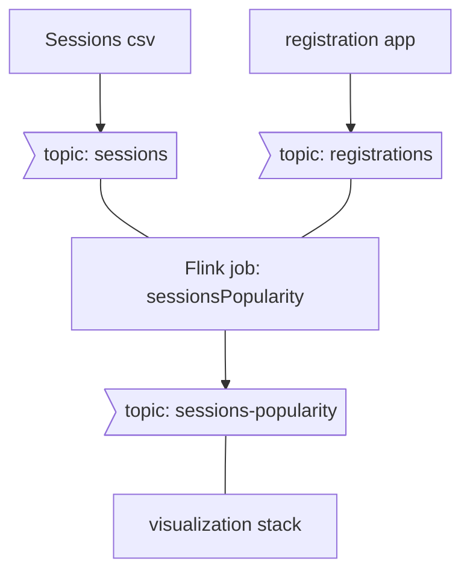

# techgym-stream-processing-demo
A flink + kotlin exercise
## Explore
Start the project 
```console
docker compose up
```
this will take a while, go explore [flink windowing docs](https://nightlies.apache.org/flink/flink-docs-master/docs/dev/table/sql/queries/window-agg/) meanwhile.

Once the stack is up, you can

- View jobs on the jobmanager:
        http://localhost:8081/#/job/running


- Dig into raw msgs and topics on the control-center (kafka ui):
        http://localhost:9021

- Monitor incoming results on the dashboard:
        http://localhost:3000/d/fdf835b7-42d2-402a-93b0-3b048a1cfd41/flink-jobs-visualization?orgId=1&refresh=5s


## What's in here

### Stack Components:
1. **registrations generator** - Mocks a registration app by producing random registration events to the registration topic
2. **kafka** - Accepts sessions list and registration events, and stores them as topics. Also stores the aggregation results.
3. A **Flink client**, To process the stream live and produce aggregation results
4. The **Visualization stack** - promtail, loki and grafana (honestly I wanted grafana to read directly from kafka but the required [plugin](https://github.com/hoptical/grafana-kafka-datasource) relies on librdkafka and won't compile on arm64 :cry:)
