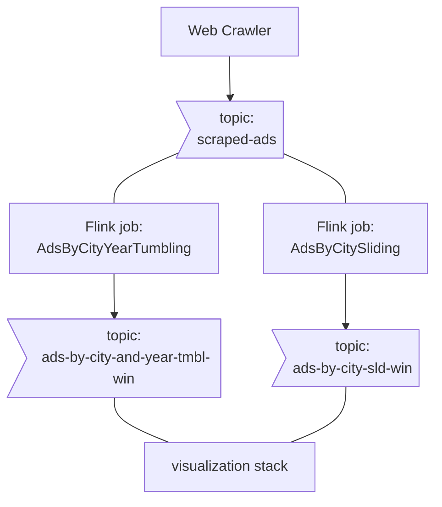

# flink-ads-processing
A flink + kotlin exercise
## Explore
Start the project 
```console
docker compose up
```
this will take a while, go explore [flink windowing docs](https://nightlies.apache.org/flink/flink-docs-master/docs/dev/table/sql/queries/window-agg/) meanwhile.

Once the stack is up, you can

- View jobs on the jobmanager:
        http://localhost:8081/#/job/running


- Dig into raw msgs and topics on the control-center (kafka ui):
        http://localhost:9021

- Monitor incoming results on the dashboard:
        http://localhost:3000/d/fdf835b7-42d2-402a-93b0-3b048a1cfd41/flink-jobs-visualization?orgId=1&refresh=5s


## What's in here

### Stack Components:
1. A **scrapy crawler** for collecting ads from a board website
2. A **kraft deployment** - stores the raw scraped-ads topic, and the output topics from flink aggregation jobs.
3. A **Flink cluster + client**, to submit and run 2 kotlin aggregation jobs.
4. The **Visualization stack** - promtail, loki and grafana (honestly I wanted grafana to read directly from kafka but the required [plugin](https://github.com/hoptical/grafana-kafka-datasource) relies on librdkafka and won't compile on arm64 :cry:)

## Helpful links (i.e. My code is copied from)
-  https://github.com/BarSnir/event_driven_freedom
-  https://github.com/katyagorshkova/kafka-kraft
-  https://github.com/dfdeshom/scrapy-kafka
-  https://github.com/valeriouberti/flink-with-kotlin


